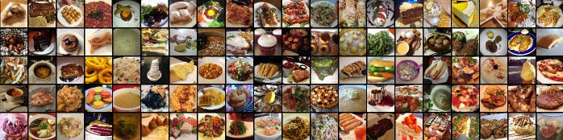
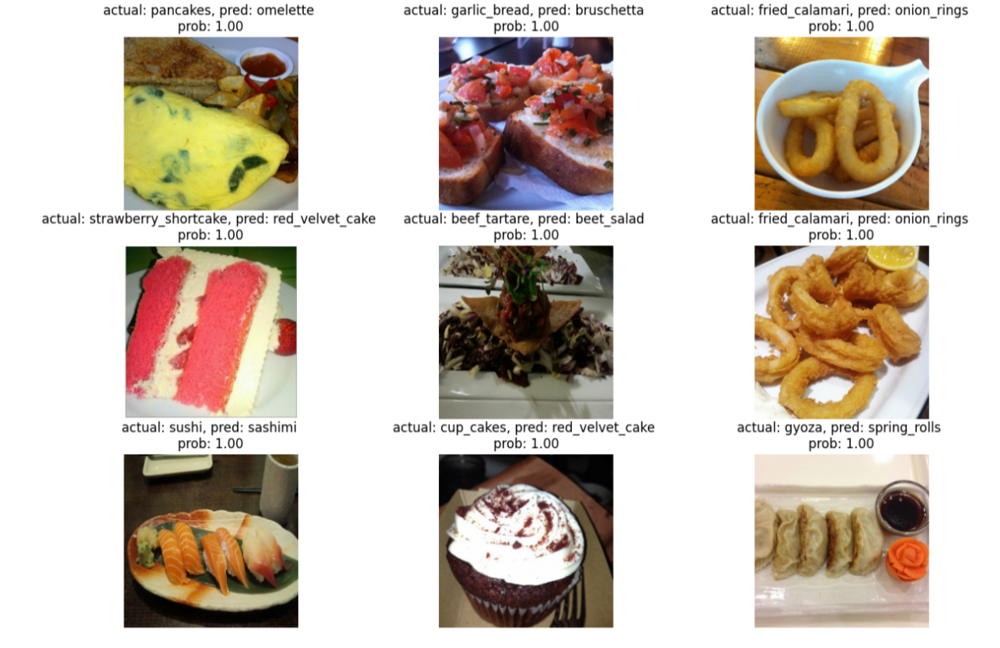

# FoodVision_Paper
The following is an implementation of the paper [Food101 paper](https://data.vision.ee.ethz.ch/cvl/datasets_extra/food-101/) in Tensorflow.

## Introduction
Building a machine learning model that's able to automatically recognizing pictured dishes.

## Dataset
Access the dataset through [TensorFlow Datasets (TFDS)](https://www.tensorflow.org/datasets/overview) - A place for prepared and ready-to-use machine learning datasets.
This dataset include all 75,750 training images and 25,250 testing images with 101 classes.
## Model

### Covering the keypoint:
* Using TensorFlow Datasets to download and explore data
* Creating preprocessing function for our data
* Batching & preparing datasets for modelling (making our datasets run fast)
* Creating modelling callbacks
* Setting up mixed precision training
* Building a feature extraction model
* Fine-tuning the feature extraction model
* Viewing training results on TensorBoard

## Inference
The following table shows the inference from the model:

